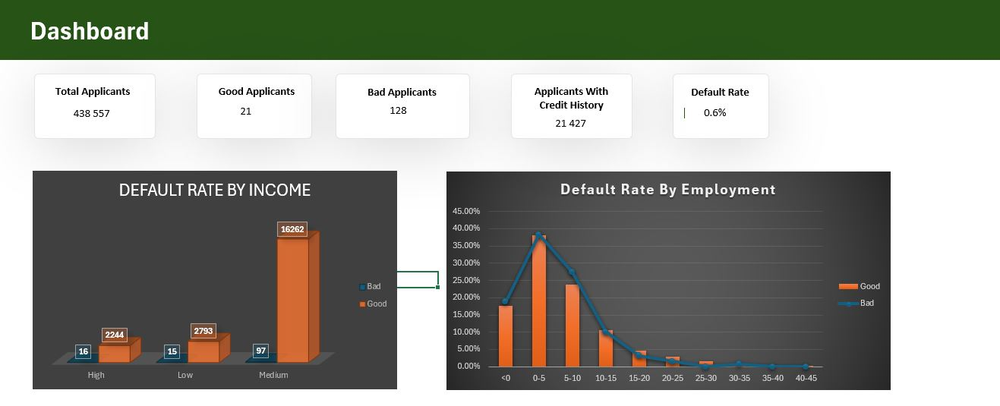
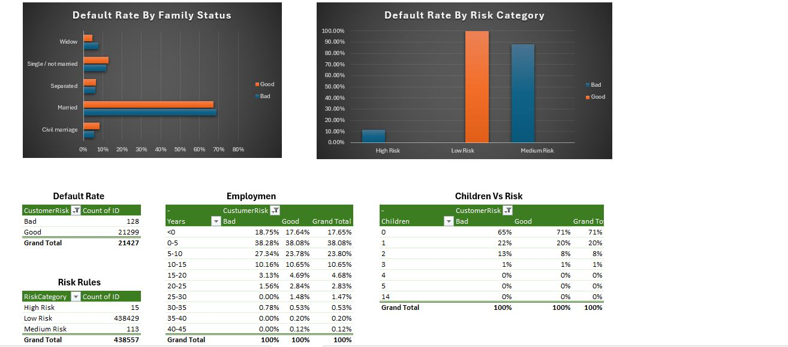
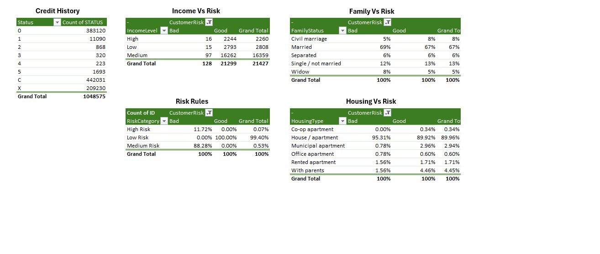

# Credit Risk Analysis & Default Prediction
## Objective

This project analyzes credit card applicant data to identify key risk factors associated with default behavior. The goal is to support financial institutions in making informed credit approval decisions by understanding customer risk profiles.

## Tools Used
- Microsoft Excel
- Pivot Tables
- Data Cleaning & Transformation
- Data Visualization

## Dataset Overview

The analysis is based on two datasets:

- application_record → Customer demographic & financial information
- credit_record → Historical credit behavior

These datasets were merged using a unique Customer ID to create a unified dataset for analysis.

## Data Preparation
- Created a CustomerRisk label (Good / Bad) using credit history
- Transformed employment duration into years & categories
- Grouped income into Low, Medium, High segments
- Built calculated fields for:
  - Default classification
  - Risk segmentation

## Key Metrics (KPIs)
- Total Applicants
- Good Applicants
- Bad Applicants
- Applicants With Credit History
- Default Rate (%) (Bad / (Good + Bad))

## Dashboard Insights
### 1. Default Rate by Income

Medium income applicants show a higher probability of default compared to low and high income groups, suggesting increased financial pressure within this segment.

### 2. Default Rate by Employment

Applicants with shorter employment duration (0–5 years) demonstrate higher default rates, indicating that employment stability is a key driver of credit risk.

### 3. Default Rate by Family Status

Family status shows limited differentiation in risk as most categories display similar default patterns.

### 4. Default Rate by Risk Category

Most identified bad customers fall within the medium risk category suggesting that moderate risk profiles may require closer monitoring as they are more likely to transition into default compared to low risk customers.

##  Dashboard Preview

## Key Findings
- Credit risk is strongly linked to employment stability and income level
- Default behavior is more common among moderate income and less stable applicants
- A large portion of applicants lack credit history, limiting full risk evaluation
- Risk is driven by a combination of factors not a single variable

## Project Structure
- data/ → Raw datasets
- dashboard/ → Excel dashboard
- screenshots/ → Visual outputs
